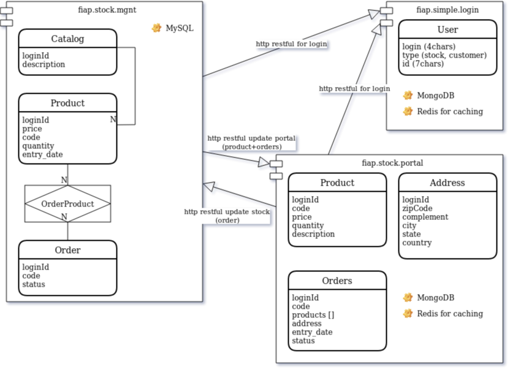

# 1 - intro

O projeto corrente atende ao trabalho da matéria ***Persistence***, que propõe o gerenciamento de um estoque, seus produtos e pedidos através de um aplicação arquitetada com diferentes bases de dados para diferentes problemas dentro deste fluxo, de estoque até a venda.  

###### Escola: FIAP
###### Curso: MBA FULLSTACK DEVELOPER, MICROSERVICES, CLOUD & IoT
###### Matéria: PERSISTENCE EM JAVA (JPA, SPRING DATA E NOSQL)
###### Prof.: RAFAEL MATSUYAMA
###### Aluno / RM: JEAN BRUNO SOUTO VILLETE / 335435

---

# 2 - execução

A instrução de execução de cada módulo está nos seus subdiretórios.  
Uma vez com todos os módulos no ar, o script ``` test-script.sh ```, na raiz do projeto base, apresenta os vários casos de uso com seus endpoints, e o que é esperado de comportamento. 

---

# 3 - diagrama de componentes

